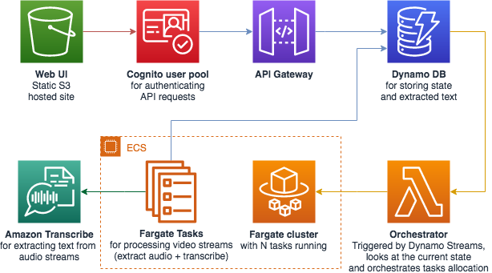

## Amazon Transcribe News Media Analysis

Transcribe news audio in realtime

This solution allows you to create transcriptions of live streaming video using AWS Transcribe. The application 
consists of a Web UI where the user may submit URLs of videos for processing, which in turn creates an ECS task per URL
running in Fargate to begin the transcription. A user can then view the video and follow the text in real time by 
clicking on the link provided by the UI. 

### Index

* [Architecture](#architecture)
* [Usage](#usage)
  * [Prerequisites](#prerequisites)
  * [Deployment](#deployment)
  * [Accessing the application](#accessing-the-application)
* [Remove the application](#remove-the-application)
* [Making changes to the code and customization](#making-changes-to-the-code-and-customization)
* [Contributing](#contributing)

### Architecture

The Transcribe News Media Analysis uses:
* [Amazon Transcribe](https://aws.amazon.com/transcribe) for transcribing audio to text
* [AWS Lambda](https://aws.amazon.com/lambda) and [Amazon ECS](https://aws.amazon.com/ecs) for computing
* [Amazon DynamoDB](https://aws.amazon.com/dynamodb) for storage
* [Amazon API Gateway](https://aws.amazon.com/api-gateway) and [Amazon Cognito](https://aws.amazon.com/cognito) for the API
* [Amazon S3](https://aws.amazon.com/s3), [AWS Amplify](https://aws.amazon.com/amplify), and [React](https://reactjs.org) for the front-end layer

An overview of the architecture is below:

### Usage

#### Prerequisites

To deploy the application you will require an AWS account. If you don’t already have an AWS account, create one at <https://aws.amazon.com> by following the on-screen instructions. Your access to the AWS account must have IAM permissions to launch AWS CloudFormation templates that create IAM roles.

To use the application you will require a browser.

#### Deployment

The application is deployed as an [AWS CloudFormation](https://aws.amazon.com/cloudformation) template.

> **Note**  
You are responsible for the cost of the AWS services used while running this sample deployment. There is no additional cost for using this sample. For full details, see the pricing pages for each AWS service you will be using in this sample. Prices are subject to change.

1. Deploy the latest CloudFormation template by following the link below for your preferred AWS region:

|Region|Launch Template|
|------|---------------|
|**US East (N. Virginia)** (us-east-1) | |
|**US East (Ohio)** (us-east-2) | |
|**US West (Oregon)** (us-west-2) | |
|**Asia Pacific (Sydney)** (ap-southeast-2) | |
|**Canada (Central)** (ca-central-1) | |
|**EU (Ireland)** (eu-west-1) | |

2. If prompted, login using your AWS account credentials.
1. You should see a screen titled "*Create Stack*" at the "*Specify template*" step. The fields specifying the CloudFormation template are pre-populated. Click the *Next* button at the bottom of the page.
1. On the "*Specify stack details*" screen you may customize the following parameters of the CloudFormation stack:
  * **Stack Name:** (Default: MediaAnalysis) This is the name that is used to refer to this stack in CloudFormation once deployed. The value must be 15 characters or less.
  * **MaxTaskCapacity:** (Default: 10) The application allows to process multiple media streams. For each processing task, a Fargate Task is created. You must customise this if you are planning to process more than 10 media streams.
  * **PrivateSubnetIpBlocks** (Default: 10.0.0.0/22, 10.0.4.0/22, 10.0.8.0/22) The Fargate Tasks will be placed in the Private subnets using the Given Ip Blocks. You must customise this if you are running other VPCs in the same AWS account.
  * **PublicSubnetIpBlocks** (Default: 10.0.12.0/22, 10.0.16.0/22, 10.0.20.0/22) The Fargate Tasks will use the Public subnets for accessing the Transcribe Service using the Given Ip Blocks. You must customise this if you are running other VPCs in the same AWS account.
  * **RetryThreshold** (Default: 3) The number of times to retry transcription if an error is encountered.
  * **TaskName** (Default: transcriber) The Fargate taskname. You must customise this if you are already running a task with the same name.
  * **VpcIpBlock** (Default: 10.0.0.0/16) The CIDR block for the VPC. You must customise this if you are running other VPCs in the same AWS account.
  * **CreateCloudFrontDistribution**  (Default: false) Creates a CloudFront distribution for accessing the web interface. _This must be enabled if S3 Block Public Access is enabled at an account level._ **Note:** Creating a CloudFront distribution may significantly increase the deploy time (from approximately 5 minutes to over 30 minutes)

   When completed, click *Next*
1. [Configure stack options](https://docs.aws.amazon.com/AWSCloudFormation/latest/UserGuide/cfn-console-add-tags.html) if desired, then click *Next*.
1. On the review you screen, you must check the boxes for:
   * "*I acknowledge that AWS CloudFormation might create IAM resources*" 
   * "*I acknowledge that AWS CloudFormation might create IAM resources with custom names*"
   * "*I acknowledge that AWS CloudFormation might require the following capability: CAPABILITY_AUTO_EXPAND*"

   These are required to allow CloudFormation to create a Role to allow access to resources needed by the stack and name the resources in a dynamic way.
1. Click *Create Change Set* 
1. On the *Change Set* screen, click *Execute* to launch your stack.
   * You may need to wait for the *Execution status* of the change set to become "*AVAILABLE*" before the "*Execute*" button becomes available.
1. Wait for the CloudFormation stack to launch. Completion is indicated when the "Stack status" is "*CREATE_COMPLETE*".
   * You can monitor the stack creation progress in the "Events" tab.
1. Note the *url* displayed in the *Outputs* tab for the stack. This is used to access the application.

#### Accessing the Application

The application is accessed using a web browser. The address is the *url* output from the CloudFormation stack created during the Deployment steps.

* Click "*Add new...  *" if you wish to add new media stream.
* Click on the "*Open in a new window*" icon to start streaming the media with the transcription.

### Remove the application

To remove the application:

1. Open the AWS CloudFormation Console
1. Click the MediaAnalysis project, right-click and select "*Delete Stack*"
1. Your stack will take some time to be deleted. You can track its progress in the "Events" tab.
1. When it is done, the status will change from DELETE_IN_PROGRESS" to "DELETE_COMPLETE". It will then disappear from the list.
When it is done, the status will change from DELETE_IN_PROGRESS" to "DELETE_COMPLETE". It will then disappear from 
the list.

### Making changes to the code and customization

The [contributing guidelines](CONTRIBUTING.md) contains some instructions about how to run the front-end locally and make changes to the back-end stack.

## Contributing

Contributions are more than welcome. Please read the [code of conduct](CODE_OF_CONDUCT.md) and the [contributing guidelines](CONTRIBUTING.md).

## License

This sample code is made available under a modified MIT license. See the LICENSE file.
